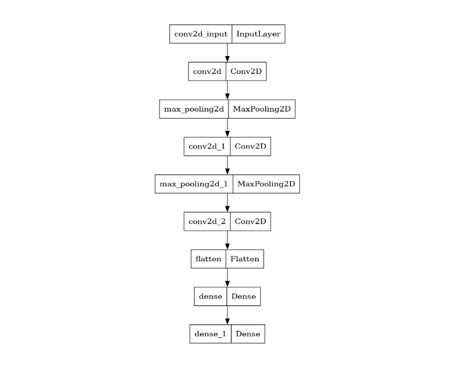
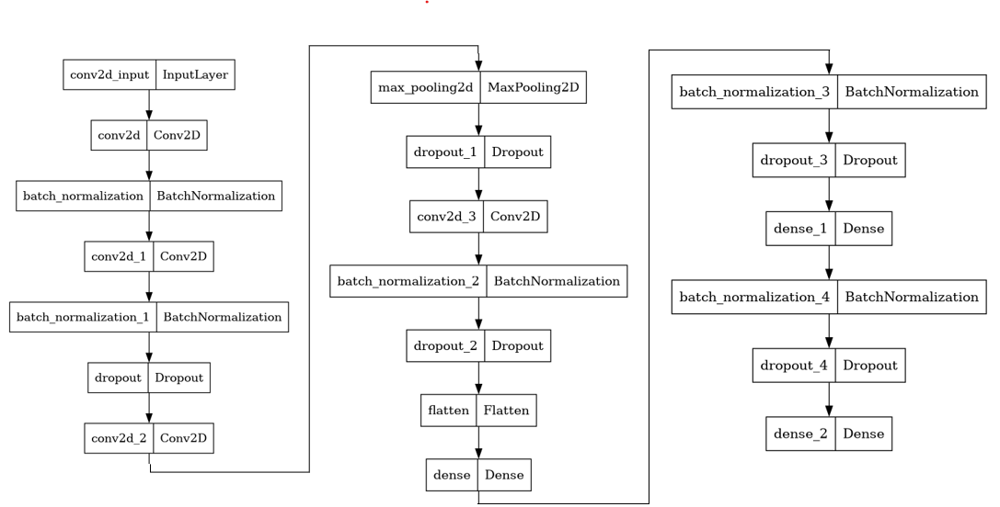

This project explores **Convolutional Neural Networks (CNNs)** for **multi-class classification of clothing items** using the [Fashion-MNIST dataset](https://github.com/zalandoresearch/fashion-mnist).  

---

## 🎯 Objective
- Build a CNN model to classify Fashion-MNIST clothing items (10 categories).  
- Start with a simple model and tweak **hyperparameters** to study their effect.  
- Experiment with a deeper CNN, dropout, batch normalization, and data augmentation.  
- Compare **optimizers** (SGD, SGD with CLR, Adam).  

---

## 📊 Dataset
- **Fashion MNIST** (by Zalando)  
- 70,000 grayscale images of size `28x28`  
  - 60,000 training images  
  - 10,000 test images  
- 10 categories of clothing items  

### Example Images

---

## 🛠️ Libraries Used
- **Visualization:** `matplotlib`, `seaborn`  
- **Modeling:** `sklearn`, `keras`  
- **Deep Learning:** `keras.models`, `keras.layers`, `keras.optimizers`, `keras.callbacks`,`lr_finder`
- **Data Handling:** `numpy`, `pandas`  

---

## 🧮 Models

### Baseline CNN (~241k parameters)
- Conv2D + MaxPooling  
- Batch Normalization, Dropout  
- Dense + Softmax output  

### Architecture

### Deeper CNN (~13M parameters)
- More Conv + Dense layers  
- Dropout & Data Augmentation  
- Optimized with Adam & SGD (CLR)  

### Architecture

---

## ⚡ Optimizers Tested
- **SGD** (with and without Cyclical Learning Rate)  
- **Adam**  

**Findings:**  
- Adam often overfitted without dropout.  
- Dropout significantly improved generalization.  
- SGD + CLR performed better on the deeper model than on the baseline.  

---

## 📈 Results

### Accuracy Comparison

### Loss Comparison

### Performance of the Deeper CNN 

---

## ✅ Conclusion
- Optimizer choice **strongly impacts performance**.  
- Deeper models + augmentation yield better results.  
- Some classes remain challenging for CNNs to classify reliably.  

---